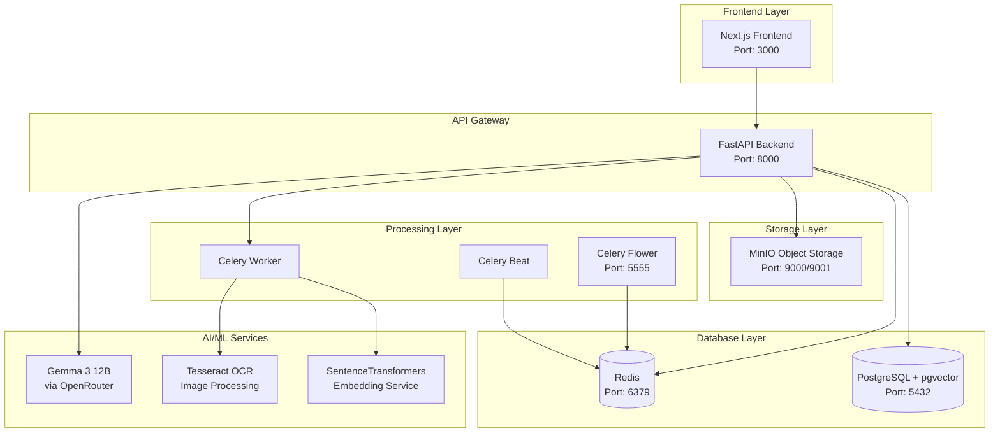
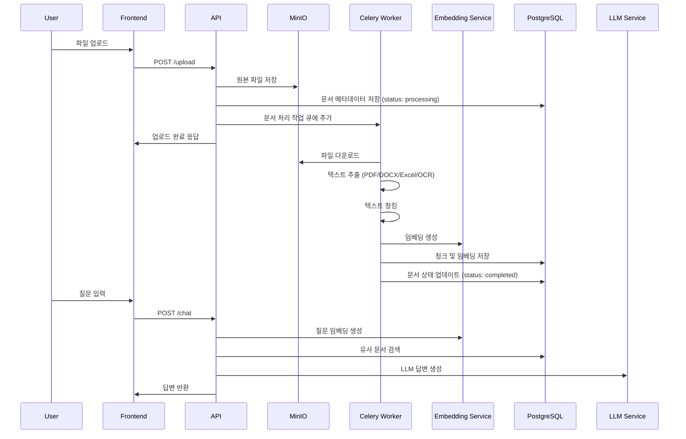
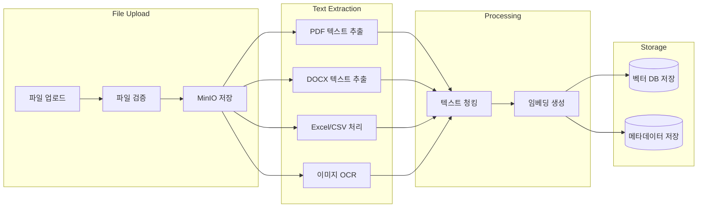
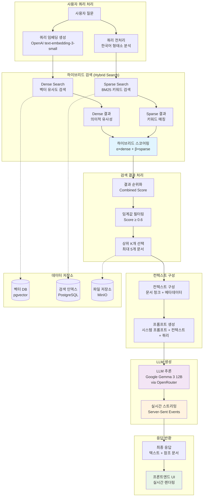

# **COMPANY-ON**
#### *사내 문서 지식 통합의 동반자*

## 1. 프로젝트 개요
분산된 사내 문서 및 사내 지식을 통합하여 불필요한 인적자원 소모를 감축하는 AI 챗봇 COMPANY-ON.
* 세션 별로 문서 검색 이력을 추적하고 비슷한 지식 검색 이력이 새로운 맥락이 되어 원하는 정보에 더 정확히 접근. 태그, 설명 등으로 이후 원활한 정보 재탐색 지원.
* 문서 필터링, 백그라운드 프로세싱으로 원활한 문서 관리 경험 지원.
* PDF, DOCX, XLSX, CSV, PNG, JPG 포맷을 지원하고 질문에 대한 응답으로 미리보기와 응답에 관련된 부분 표시. 문서와 연계되는 검색 경험 지원.

## 2. 프로젝트 실행 방법
#### 사전 요구사항
- Docker & Docker Compose
- Node.js 18+ (로컬 프론트엔드 실행 시)
- Python 3.11+ (로컬 백엔드 실행 시)

#### 방법 1 : **권장 실행 환경**
- **백엔드**는 Docker로 의존성 문제를 최소화하여 실행
- **프론트엔드**는 빠른 상호작용을 위해 로컬로 실행
- 준비사항
    - Node.js 필요
    - Docker Daemon 활성화 상태에서 진행
    - 포트 관리에 주의해야 함.
```bash
# 1. 백엔드 서비스 시작 (Docker)
docker-compose up -d postgres redis minio backend celery-worker celery-beat celery-flower
# Docker 컨테이너 내에서 마이그레이션 실행
docker-compose exec backend alembic upgrade head

# 2. 프론트엔드 시작 (로컬)
cd frontend
npm install
npm run dev

# 3. 브라우저에서 접속
open http://localhost:3000
```

#### 방법 2: Docker 실행
```bash
# 모든 서비스 시작
docker-compose up -d

# 데이터베이스 마이그레이션
docker-compose exec backend alembic upgrade head

# 프론트엔드 실행
cd frontend
npm install
npm run dev
```

#### 방법 3: 로컬 실행
Docker 컨테이너에서 실행하면 macOS에서 성능이 크게 저하될 수 있습니다. 로컬 실행을 권장합니다.

##### 3-1. 데이터베이스 및 Redis 실행 (Docker)
```bash
# 데이터베이스와 Redis만 Docker로 실행
docker-compose up -d postgres redis minio

# 데이터베이스 마이그레이션
docker-compose exec postgres psql -U postgres -d ragbot -c "CREATE EXTENSION IF NOT EXISTS vector;"
```

##### 3-2. 백엔드 로컬 실행
```bash
# 백엔드 디렉토리로 이동
cd backend

# 가상환경 생성 및 활성화
python -m venv venv
source venv/bin/activate  # macOS/Linux
# 또는
venv\Scripts\activate  # Windows

# 의존성 설치
pip install -r requirements.txt

# 환경변수 설정
cp .env.example .env
# .env 파일에서 OpenRouter API 키 등 설정

# 백엔드 서버 실행
uvicorn app.main:app --reload --host 0.0.0.0 --port 8000
```

##### 3-3. Celery Worker 로컬 실행
```bash
# 백엔드 디렉토리에서 (가상환경 활성화 상태)
celery -A app.celery worker --loglevel=info

# 별도 터미널에서 Celery Beat 실행 (선택사항)
celery -A app.celery beat --loglevel=info

# Flower 모니터링 (선택사항)
celery -A app.celery flower --port=5555
```

##### 3-4. 프론트엔드 로컬 실행
```bash
# 프론트엔드 디렉토리로 이동
cd frontend

# 의존성 설치
npm install

# 프론트엔드 서버 실행
npm run dev
```

#### 4. 서비스 접속
- **웹 애플리케이션**: http://localhost:3000
- **백엔드 API**: http://localhost:8000/docs
- **백엔드 Health Check** : http://localhost:8000/health
- **Celery Flower**: http://localhost:5555
- **MinIO Console**: http://localhost:9001


## 3. 주요 기술
#### 선택 기준
1. AI를 활용한 빠른 프로토타입 개발을 위해 참고할 데이터가 많은 스택
2. AI API와의 높은 호환성을 보이는 스택
3. 주어진 태스크에서 쓸 수 있는 충분한 라이브러리를 확보하고 마찬가지로 데이터가 많은 스택
4. 한국어 지원이 가능한 스택
5. 확장 가능성을 염두에 두고 프로토타이핑 해볼 수 있는 저비용, 혹은 무비용의 스택

#### 선택한 스택
##### Frontend
- **Next.js 15.5.2** + **TypeScript**
  - **선택 이유**: 
    - TypeScript로 타입 안정성 확보
    - React 18의 최신 기능 활용 (Concurrent Features, Suspense)
    - API Routes를 통한 백엔드 프록시 설정

- **Tailwind CSS**
  - **선택 이유**: 
    - 유틸리티 퍼스트 CSS 프레임워크로 빠른 스타일링
    - 반응형 디자인 쉬운 구현
    - 번들 크기 최적화 -> 불필요한 최적화 업무 최소화(사용하지 않는 CSS 자동 제거)

- **Lucide React**
  - **선택 이유**: 
    - 경량화된 아이콘 라이브러리
    - 일관되고 빠른, 임시적 디자인 시스템 구축

### Backend
- **FastAPI** + **Python 3.11**
  - **선택 이유**: 
    - 비동기 웹 프레임워크
    - 자동 OpenAPI 문서 생성
    - Pydantic을 통한 데이터 검증
    - WebSocket 지원으로 실시간 기능 구현

- **PostgreSQL 16** + **pgvector**
  - **선택 이유**: 
    - 벡터 데이터베이스 기능 내장 (pgvector extension)
    - 사용 경험이 있는 스택
    - 보편적인 선택으로 참고할 데이터 다량 존재

- **Redis**
  - **선택 이유**: 
    - Celery 메시지 브로커로 사용
    - 세션 및 캐시 스토리지
    - 고성능 인메모리 데이터베이스

- **MinIO**
  - **선택 이유**: 
    - S3 호환 오브젝트 스토리지
    - 대용량 파일의 "원본" 저장 및 관리

### AI/ML 모델
- **SentenceTransformers** (paraphrase-multilingual-MiniLM-L12-v2)
  - **선택 이유**: 
    - 임베딩에 사용
    - 다국어 지원 (한국어 포함)
    - 비용 없음

- **Google Gemma 3 12B** (via OpenRouter)
  - **선택 이유**: 
    - 한국어 성능 준수
    - openRouter 서비스와 연계하여 모델 변경의 확장성 확보
    - API 기반으로 인프라 부담 최소화
    - 무료 티어 지원

- **Tesseract OCR**
  - **선택 이유**: 
    - 오픈소스 OCR 엔진
    - 다양한 언어 지원 (한국어 + 영어)

### 비동기 작업 처리
- **Celery** + **Flower**
  - **선택 이유**: 
    - 문서 처리 작업의 비동기 처리
    - 작업 큐 모니터링 및 관리 용이
    - 확장 가능한 워커 아키텍처


## 4. 시스템 아키텍처

#### 전체 아키텍처 다이어그램



#### 데이터 플로우



#### 문서 처리 파이프라인



#### RAG 파이프라인



## 5. 개발 과정
- 총 소요 시간 : 27시간
- 총 소요 일수 : 4일
1. 과제 기획, 태스크 구체화
2. 구체화된 태스크 문서 작성 및 AI Agent에 주입
3. 태스크의 선후관계 및 우선순위 정의 후 각 단계 수행 
    - 단계 수행 중 처음 써보는 스택에 대해서는 학습 문서 작성
    - 사전 정의한 태스크 문서 최신화로 진척도 지속 추적
4. 프로토타입 빌드 


## 6. 과제 진행 중 어려웠던 점과 해결 과정
AI 에이전트와 함께 개발을 했기 때문에 

## 7. RAG 아키텍처의 정확도 개선을 위한 아이디에이션
### 7-1. 기본 구조 요약
- **지식 파이프라인(Knowledge Pipeline)**: 사내 문서를 자체 **Knowledge Base**로 축적하고, 문서 청크를 임베딩하여 메타데이터와 함께 저장합니다. (문서 원본: MinIO, 메타/청크/임베딩: PostgreSQL+pgvector)
- **1) 쿼리 전처리**: 질문에서 핵심 키워드를 추출하고, 키워드 및 전체 쿼리에 대한 임베딩을 생성합니다.
- **2) 검색**: 생성된 표현(임베딩·키워드)으로 KB에서 유사 청크를 검색합니다. 벡터 유사도(코사인)와 텍스트 유사도(BM25 등)를 활용합니다.
- **3) 맥락 구성**: 대화 이력, 검색 결과, 사용자의 현재 쿼리를 바탕으로 LLM에 전달할 컨텍스트를 구성합니다.
- **4) 생성**: LLM이 컨텍스트 기반으로 답변을 생성하고 반환합니다.

### 7-2. 한계점 정리
- **전처리 키워드의 신뢰성**: 자동 추출 키워드가 항상 유의미하다고 보장하기 어렵습니다.
- **맥락 비고려 키워드 검색**: 키워드 중심 검색만으로는 대화 맥락과의 연관을 놓치기 쉽고, 연쇄적·종합적 사고가 약화됩니다.
- **임베딩 호환성 불확실성**: 쿼리 임베딩과 KB(Knowledge Base) 임베딩이 의미론적으로 항상 잘 호환되는지 보장/검증이 어렵습니다.
- **표현 변형/잡음 취약성**: 패러프레이즈, 오탈자, 공백 처리 부재 시 검색 정확도가 하락할 수 있습니다.
- **무관 맥락 과잉 적용**: 다른 주제의 대화 이력이 과도하게 반영되면 답변 품질이 저하됩니다.
- **생성기 의존성**: 최종 품질이 모델의 추론 능력과 프롬프트 엔지니어링에 크게 좌우됩니다.

### 7-3. 개선 아이디어: 의미소(Graph) 기반 보강 검색
핵심: 서버 측에서 의미적 유사도를 가중치로 갖는 **의미소 그래프(Sememe Graph)**를 유지·활용하여, 키워드 추출과 맥락 반영 정확도를 높입니다.

- **그래프 구성**
  - 정점(Vertex): KB의 각 청크(또는 개념·키워드). 임베딩이 생성될 때마다 정점 추가.
  - 간선(Edge): 코사인 유사도가 임계값(예: 0.75) 이상인 정점 쌍을 연결하고, 가중치로 유사도 점수를 저장.
  - 유지 전략: 주기적(또는 배치/스트리밍)으로 신규 임베딩에 대해 근접 이웃 탐색(ANN) 후 간선 갱신.

- **검색 시 활용**
  - 1차 확장: 쿼리에서 추출된 키워드/청크에 연결된 1-홉 이웃을 추가 후보로 확장하여 검색 쿼리에 포함.
  - 가중 통합: 원 키워드 점수와 그래프 간선 가중치를 결합해 후보 우선순위를 재계산(예: α·BM25 + β·cos + γ·graph).
  - 맥락 반영: 최근 대화 이력의 핵심 표현을 정점으로 맵핑하고, 쿼리 키워드와의 그래프 상 거리에 따라 맥락 가중치를 부여(무관 맥락은 감쇠).

- **전처리/정규화 보강**
  - 동형어·표기 변형 처리(토큰 정규화, 띄어쓰기 보정), 오탈자 교정, 패러프레이즈 확장(동의어/유의어 그래프 병합)으로 검색 강건성 강화.

- **선정/필터링 정책**
  - 하이브리드 스코어(예: α×dense + β×sparse + γ×graph)로 재순위화.
  - 임계값 필터(예: 0.6~0.7)로 낮은 신뢰도 문서를 제거하고, 최종 Top-K(예: 최대 5개)만 컨텍스트로 사용.

- **기대 효과와 트레이드오프**
  - 장점: 맥락 연계 검색력 향상, 누락 감소, 표현 변형/노이즈에 강건, 정확한 컨텍스트 구성으로 생성 품질 개선.
  - 비용: 그래프 유지 비용, 추가 연산(1-홉 확장/재랭킹)으로 인한 지연 증가. 캐시·임계값/가중치 튜닝으로 완화 필요.


### *과제를 마치며,*