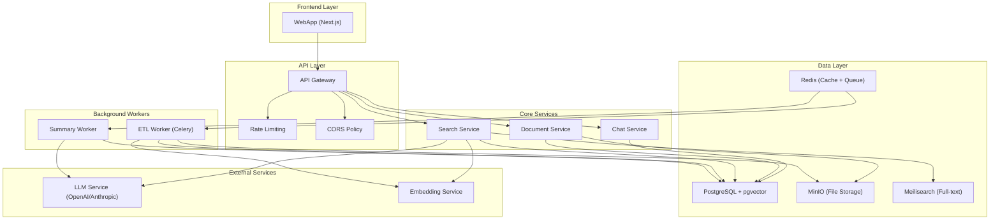

좋아! 요청대로 ChatGPT처럼 채팅 기록을 관리하는 설계까지 포함해, 전체를 다시 정리했어.
형식은 기획 → 시스템 아키텍처 → 기술 스택 순이며, WebApp 우선 → DesktopApp/macos 확장, Auth는 확장 여지 유지(간단 구현부터) 원칙을 그대로 따른다.

⸻

1) 기획 (Problem → Goal → KPI → 범위 + 채팅 기록)

문제
	•	문서가 분산되어 있고, 검색·활용이 어려움 → 시간 낭비.
	•	지식 검색 외에도 대화 이력(맥락) 관리가 없어 재질문 시 반복 비용 큼.

목표
	•	문서 지식 단일 창구 + 대화 중심 업무흐름.
	•	문서 업로드→자동 처리(RAG)→질문→대화 맥락 유지→출처 링크/피드백.

핵심 사용자 가치
	•	디렉토리 기반 문서 관리 UI(업/삭/재처리/다운로드) - 모든 사용자가 동일한 문서에 접근.
	•	개인화된 채팅 UI: 스트리밍 응답, 개인별 세션/메시지 이력 관리, 출처·딥링크, 피드백.
	•	개인 세션 검색/태그/핀(Pin) 맥락, 자동 요약/제목 생성으로 긴 대화도 가볍게.
	•	문서는 공유, 채팅 세션은 개인별로 분리된 하이브리드 구조.

KPI(초기)
	•	사용자 피드백 기반 검색 정확도, 평균 응답시간(≤3s), 대화 재사용률, 세션 검색 만족도.

범위(1차 MVP)
	•	파일: PDF/DOCX/XLSX/CSV/PNG/JPG.
	•	문서 접근: 인증 없이 모든 사용자가 동일한 문서에 접근.
	•	채팅 세션: 클라이언트별 개인화된 세션 관리 (브라우저 세션/로컬 스토리지 기반).
	•	결과물: WebApp (Desktop 래핑 제외).
	•	채팅 기록: 개인별 세션 저장, 피드백(좋아요/싫어요), 자동 제목/요약.

⸻

2) 시스템 아키텍처 (채팅 기록 포함)



**확장성 고려사항:**
- **수평 확장**: 각 서비스를 독립적으로 스케일링 가능
- **캐싱 전략**: Redis를 통한 다층 캐싱
- **비동기 처리**: Celery를 통한 백그라운드 작업 분리

채팅 기록의 핵심 설계 포인트
	•	개인화된 세션 관리: 클라이언트별로 독립적인 채팅 세션 (브라우저 세션/로컬 스토리지 기반).
	•	세션 식별: 클라이언트 ID (UUID) 기반으로 개인별 세션 구분.
	•	메시지 단위 저장: 사용자/어시스턴트 각각 메시지 레코드 + 출처(citations)·피드백·편집 이력.
	•	맥락 관리:
	•	윈도우드 컨텍스트: 최근 N개 메시지만 LLM에 주입 + 핵심 요약을 시스템 컨텍스트로 핀.
	•	세션 요약(자동): 메시지 축적 시 워커가 요약 갱신 → 긴 세션도 가볍게.
	•	핀(Pinned): 사용자가 특정 메시지/파일/지시문을 "고정 컨텍스트"로 설정.
	•	검색: 개인 세션/메시지를 BM25 + 임베딩으로 검색(키워드+의미).
	•	피드백: 사용자가 응답의 정확성에 대해 좋아요/싫어요 피드백 제공.
	•	보존/프라이버시: 개인 세션은 해당 클라이언트만 접근 가능, 삭제/내보내기 제공.

⸻

3) 기술 스택 (채팅 기록 포함)

**프런트엔드（Web Only）**

*선택 기술: Next.js + React Query*
- **선택 근거**: SSR/SSG 지원, 자동 코드 분할, 내장 API 라우트, SEO 최적화
- **핵심 라이브러리**: 
  - `react-query`: 서버 상태 관리 및 캐싱
  - `react-dropzone`: 파일 업로드 UX
  - `PDF.js/docx-preview`: 문서 미리보기
  - `@tanstack/react-virtual`: 가상 스크롤링 (대량 세션 리스트)
- **대안 기술**: SvelteKit (더 가벼움), Solid.js (성능 우수)

**백엔드（FastAPI）**

*선택 기술: FastAPI + SQLAlchemy*
- **선택 근거**: 자동 API 문서화, 타입 힌트 지원, 비동기 처리, 높은 성능
- **핵심 구성요소**:
  - `SQLAlchemy + Alembic`: ORM 및 마이그레이션
  - `Celery + Redis`: 백그라운드 작업 큐
- **대안 기술**: Django (풍부한 생태계), Flask (가벼움), Go (고성능)
- **성능 최적화**: 
  - Connection pooling
  - Query 최적화 (N+1 문제 해결)
  - Redis 캐싱 전략

**저장소/검색**

*선택 기술: PostgreSQL + pgvector*
- **선택 근거**: ACID 보장, 벡터 검색 내장, 성숙한 생태계
- **구성요소**:
  - `PostgreSQL 16 + pgvector`: 메타데이터 + 벡터 검색
  - `MinIO`: S3 호환 객체 스토리지
  - `Meilisearch`: 빠른 풀텍스트 검색
- **대안 기술**: 
  - 벡터 DB: Pinecone (관리형), Weaviate (자체 호스팅)
  - 검색: Elasticsearch (복잡하지만 강력함)

**임베딩/검색/RAG**

*선택 기술: multilingual-e5-base*
- **선택 근거**: 다국어 지원, 768차원 (균형), L2 정규화
- **검색 전략**: 하이브리드 검색 (BM25 + Dense)
- **대안 기술**: 
  - `text-embedding-ada-002` (OpenAI)
  - `sentence-transformers/all-MiniLM-L6-v2` (경량)
- **성능 최적화**:
  - 임베딩 캐싱
  - 청크 크기 최적화 (512-1024 토큰)
  - 하이브리드 검색 가중치 튜닝

⸻

데이터 모델 (핵심 테이블)

-- 채팅 세션 (개인화)
CREATE TABLE chat_sessions (
  id BIGSERIAL PRIMARY KEY,
  client_id UUID NOT NULL,                 -- 클라이언트별 개인화 식별자
  title TEXT,                              -- 자동 생성/수정 가능
  summary TEXT,                            -- 세션 요약(자동/수동)
  tags TEXT[],                             -- 태그(예: ["온보딩","정책"])
  pinned_context JSONB,                    -- 핀: 문구/메시지ID/파일 등
  created_at TIMESTAMPTZ DEFAULT now(),
  updated_at TIMESTAMPTZ DEFAULT now()
);

-- 메시지
CREATE TABLE chat_messages (
  id BIGSERIAL PRIMARY KEY,
  session_id BIGINT REFERENCES chat_sessions(id) ON DELETE CASCADE,
  role TEXT NOT NULL CHECK (role IN ('user','assistant','system')),
  content TEXT NOT NULL,                   -- 토큰화 전에 원문 저장
  token_count INT,                         -- 추정치 저장(비용/윈도 관리)
  citations JSONB,                         -- [{doc_id, version, chunk_id, page, score}]
  feedback TEXT,                           -- 'up'|'down'|'none' + 코멘트
  parent_id BIGINT,                        -- 향후 스레딩용
  created_at TIMESTAMPTZ DEFAULT now()
);

-- 세션 검색용 임베딩(요약/대표)
CREATE TABLE chat_session_embeddings (
  session_id BIGINT PRIMARY KEY REFERENCES chat_sessions(id) ON DELETE CASCADE,
  embedding vector(768)
);

-- 메시지 검색용 임베딩(옵션: 최근 K개만)
CREATE TABLE chat_message_embeddings (
  message_id BIGINT PRIMARY KEY REFERENCES chat_messages(id) ON DELETE CASCADE,
  embedding vector(768)
);

-- 인덱스 전략 (개인화 고려)
CREATE INDEX ON chat_sessions (client_id, created_at DESC);
CREATE INDEX ON chat_sessions USING gin (tags);
CREATE INDEX ON chat_messages (session_id, role, created_at);
CREATE INDEX ON chat_messages (created_at DESC) WHERE role = 'user';
CREATE INDEX ON chat_session_embeddings USING hnsw (embedding vector_cosine_ops);
CREATE INDEX ON chat_message_embeddings USING hnsw (embedding vector_cosine_ops);

-- 추가 테이블 제안
CREATE TABLE embedding_cache (
  id BIGSERIAL PRIMARY KEY,
  content_hash TEXT UNIQUE NOT NULL,
  embedding vector(768) NOT NULL,
  model_name TEXT NOT NULL,
  created_at TIMESTAMPTZ DEFAULT now()
);

-- 파티셔닝 전략 (대용량 데이터 대비)
-- 시간 기반 파티셔닝 (월별)
CREATE TABLE chat_messages_y2024m01 PARTITION OF chat_messages
FOR VALUES FROM ('2024-01-01') TO ('2024-02-01');

권한 원칙: 
- 문서: 모든 사용자가 동일한 문서에 접근 가능
- 채팅 세션: client_id 기반으로 개인별 세션 격리

⸻

채팅 관련 API 계약 (요지)

**API 버전 관리**
- 기본 경로: `/api/v1/`
- 하위 호환성 보장 (v1 → v2 마이그레이션 전략)

**에러 처리 표준**
```json
{
  "error": {
    "code": "VALIDATION_ERROR",
    "message": "Invalid input parameters",
    "details": {
      "field": "user_message",
      "reason": "Message cannot be empty"
    },
    "timestamp": "2024-01-01T00:00:00Z",
    "request_id": "req_123456789"
  }
}
```

**보안 강화**
- Rate Limiting: IP당 분당 요청 수 제한
- CORS Policy: 허용된 도메인만 접근
- 입력 검증: SQL Injection, XSS 방지

**세션 API (개인화)**
- `POST /api/v1/chat/sessions` → 새 개인 세션 생성(옵션: 초기 system/pinned_context)
  - 요청: `{ client_id: "uuid", title?, pinned_context? }`
- `GET /api/v1/chat/sessions?client_id={uuid}&query=&tag=&pinned=&limit=...` → 개인 세션 목록(검색/필터/정렬)
- `GET /api/v1/chat/sessions/{id}?client_id={uuid}` → 개인 세션 상세(제목/요약/메시지 목록 페이지네이션)
- `PATCH /api/v1/chat/sessions/{id}?client_id={uuid}` → 제목/태그/핀 수정
- `DELETE /api/v1/chat/sessions/{id}?client_id={uuid}` → 개인 세션 삭제

**메시지 API (개인화)**
- `POST /api/v1/chat/sessions/{id}/messages?client_id={uuid}` → SSE 응답
  - 요청: `{ user_message, options:{top_k, temperature, max_tokens} }`
  - 흐름: (1) 유저 메시지 저장 → (2) 검색/컨텍스트 구성 → (3) LLM 스트리밍 → (4) 어시스턴트 메시지 저장(인용/출처 포함)
- `PATCH /api/v1/chat/messages/{id}?client_id={uuid}` → 메시지 편집(유저 메시지), 피드백/메모
- `DELETE /api/v1/chat/messages/{id}?client_id={uuid}` → 메시지 삭제

**피드백 API (개인화)**
- `POST /api/v1/chat/messages/{id}/feedback?client_id={uuid}` → 좋아요/싫어요 피드백 저장

**문서 관리 API**
- `POST /api/v1/documents/upload` → 문서 업로드 시작 (Init)
  - 요청: `{ filename, size, content_type }`
  - 응답: `{ upload_id, upload_url, expires_at }`
- `PUT /api/v1/documents/upload/{upload_id}` → 문서 업로드 완료 (Commit)
  - 요청: `{ upload_id, metadata: { title, description, tags } }`
  - 응답: `{ document_id, status: "processing" }`
- `GET /api/v1/documents` → 문서 목록 조회
  - 쿼리: `?status=&search=&page=&limit=`
  - 응답: `{ documents: [...], total, page, limit }`
- `GET /api/v1/documents/{id}` → 문서 상세 조회
  - 응답: `{ id, title, status, metadata, created_at, updated_at }`
- `GET /api/v1/documents/{id}/download` → 문서 다운로드
  - 응답: 파일 스트림 또는 다운로드 URL
- `POST /api/v1/documents/{id}/reprocess` → 문서 재처리
  - 요청: `{ options: { force: true, chunk_size: 512 } }`
  - 응답: `{ task_id, status: "queued" }`
- `DELETE /api/v1/documents/{id}` → 문서 삭제
  - 응답: `{ success: true, deleted_at }`
- `GET /api/v1/documents/{id}/chunks` → 문서 청크 목록
  - 쿼리: `?page=&limit=&search=`
  - 응답: `{ chunks: [...], total }`
- `GET /api/v1/documents/{id}/preview` → 문서 미리보기
  - 응답: HTML 형태의 미리보기 또는 이미지

**유틸리티 API (개인화)**
- `POST /api/v1/chat/sessions/{id}/summarize?client_id={uuid}` → 백그라운드 요청(Worker)
- `POST /api/v1/chat/sessions/{id}/title?client_id={uuid}` → 최근 N개로 제목 생성
- `GET /api/v1/chat/sessions/{id}/export?client_id={uuid}&fmt=md|json` → Markdown/JSON (첨부: 출처 링크 포함)
- `GET /api/v1/health` → 헬스체크
- `GET /api/v1/metrics` → 시스템 메트릭

⸻

컨텍스트 윈도우 전략 (ChatGPT 유사)
	1.	최근 N 메시지(예: 최근 8~12 turn) + 핀 컨텍스트(고정 규칙/FAQ/도메인 지식) + 세션 요약(있다면).
	2.	길이 초과 시:
	•	오래된 메시지를 우선 제외
	•	그래도 길면 세션 요약을 재생성하여 시스템 컨텍스트로 대체
	3.	RAG 연결:
	•	사용자 질문 + (필요 시) 직전 어시스턴트 요약을 쿼리로 하이브리드 검색
	•	청크 dedup/압축 → 인용 가능한 짧은 근거를 유지
	4.	출처 저장: assistant 메시지에 citations로 chunk id/score/page 저장 → UI에서 하이라이트/딥링크

⸻

프런트 UX 디테일 (개인화)
	•	세션 리스트 + 파일 디렉토리 리스트뷰(왼쪽 패널 드로우바, 상단 네비게이션 버튼으로 모드 전환)
	•	개인 세션 검색(제목/요약/최근 메시지 임베딩 기반), 태그 필터, 정렬(최근/수정/별표)
	•	세션 hover 메뉴: 이름 바꾸기/내보내기/삭제 (개인 세션만)
	•	채팅 뷰 (개인화)
	•	메시지 hover 메뉴: 복사, 피드백(좋아요/싫어요/메모), 인용 보기
	•	인용 패널: 문서명/페이지/경로/스코어, 클릭 시 미리보기/원문
	•	상단: 핀 컨텍스트 뱃지(마우스오버로 내용 표시), 세션 제목(자동/수정)
	•	입력창: 파일 드롭(공유 스토리지에 파일 업로드→ETL)
	•	클라이언트 ID 관리: 브라우저 세션/로컬 스토리지 기반 UUID 생성 및 관리

⸻

보존·프라이버시·거버넌스 (개인화)
	•	기본은 개인 세션(client_id 기반).
	•	각 클라이언트는 자신의 세션에만 접근 가능.
	•	삭제/익명화: 한 번에 세션 전체 삭제, 또는 메시지 단위 삭제.
	•	감사 로그: 세션 접근/내보내기 이벤트 기록.
	•	보존 기한: 기본 무제한, 자동 아카이브/정리 작업(Worker).

⸻

운영·성능 팁 (개인화)
	•	긴 세션은 20~30 turn을 넘기면 요약 백그라운드 작업을 트리거 → 세션 로딩/LLM 비용 절감.
	•	세션/메시지 임베딩은 최근 K개만 생성(모두 생성하지 않음) → 검색 성능과 저장 공간 균형.
	•	SSE 실패 대비 메시지 저장 순서: 유저 메시지 선저장 → 응답 토큰 누적 중 주기적 체크포인트 → 완료 후 최종 저장.
	•	개인 세션 대비: client_id 기반 인덱스로 빠른 조회, 페이지네이션 + 가상 스크롤 필수.

⸻

4) 단계별 마일스톤 (채팅 기록 포함)

**M1 — 로컬 인프라 기동** (예상 소요: 1일)
- **목표**: 개발 환경 구축 및 기본 서비스 기동
- **성공 기준**: 
  - Docker Compose로 모든 서비스 정상 기동
  - 헬스체크 엔드포인트 응답 확인
  - 데이터베이스 마이그레이션 성공
- **구현 내용**:
  - Compose: db/redis/minio/api/worker/frontend
  - Alembic 스키마에 chat_sessions/chat_messages 포함
  - Dev Token 발급(회사/역할 클레임)
- **리스크**: Docker 환경 설정 이슈, 포트 충돌
- **테스트**: 통합 테스트 (서비스 간 연결 확인)

**M2 — 문서 파이프라인** (예상 소요: 2일)
- **목표**: 문서 업로드부터 검색까지 전체 파이프라인 구축
- **성공 기준**:
  - PDF/DOCX 파일 업로드 및 처리 성공
  - 벡터 임베딩 생성 및 저장
  - 하이브리드 검색 결과 반환
- **구현 내용**:
  - 업로드 Init/Commit → ETL(추출/청킹/임베딩) → 리스트/다운로드
- **리스크**: 대용량 파일 처리 성능, 임베딩 모델 로딩 시간
- **테스트**: 단위 테스트 (ETL 각 단계), 통합 테스트 (전체 파이프라인)

**M3 — 채팅 이력 MVP** (예상 소요: 2일)
- **목표**: 기본 채팅 기능 및 세션 관리 구현
- **성공 기준**:
  - 세션 생성/조회/삭제 정상 동작
  - SSE를 통한 실시간 메시지 스트리밍
  - 출처 링크 및 피드백 저장
- **구현 내용**:
  - POST /chat/sessions, GET /chat/sessions, GET /chat/sessions/{id}
  - POST /chat/sessions/{id}/messages (SSE)
  - 세션 제목 자동 생성, 메시지 피드백 저장, 인용 저장/표시
- **리스크**: SSE 연결 안정성, LLM 응답 지연
- **테스트**: E2E 테스트 (사용자 시나리오), 성능 테스트 (동시 사용자)

**M4 — 세션 관리 고도화** (예상 소요: 2일)
- **목표**: 고급 세션 관리 기능 및 사용자 경험 개선
- **성공 기준**:
  - 세션 검색 정확도 80% 이상
  - 공유 링크 접근 권한 검증
  - 내보내기 기능 정상 동작
- **구현 내용**:
  - 세션 검색(키워드+임베딩), 태그/핀, 공유 링크, 내보내기
  - 백그라운드 요약/아카이브 작업
- **리스크**: 검색 성능 최적화, 백그라운드 작업 안정성
- **테스트**: 부하 테스트 (대량 세션), 보안 테스트 (권한 검증)

**M5 — 프로덕션 배포** (예상 소요: 1일)
- **목표**: 웹 애플리케이션 프로덕션 배포 및 최적화
- **성공 기준**:
  - 프로덕션 환경에서 정상 동작
  - 성능 최적화 완료
  - 모니터링 설정 완료
- **구현 내용**:
  - Docker 프로덕션 이미지 빌드, 배포 파이프라인 구축
- **리스크**: 프로덕션 환경 설정 이슈, 성능 최적화
- **테스트**: 부하 테스트, 보안 테스트

**전체 테스트 전략**
- **단위 테스트**: 각 컴포넌트별 기능 검증 (목표 커버리지: 80%)
- **통합 테스트**: 서비스 간 연동 검증
- **E2E 테스트**: 사용자 시나리오 기반 테스트
- **성능 테스트**: 부하 및 스트레스 테스트
- **보안 테스트**: 인증/인가, 입력 검증, SQL Injection 등

⸻

5) 보안 및 컴플라이언스

**데이터 보안**
- **전송 암호화**: HTTPS/TLS 1.3 강제 적용
- **저장 암호화**: 민감한 데이터 AES-256 암호화
- **키 관리**: 환경변수 기반 키 관리, 키 로테이션 정책

**접근 제어**
- **Rate Limiting**: IP 기반 요청 제한
- **입력 검증**: 모든 입력 데이터 검증 및 sanitization

**감사 및 컴플라이언스**
- **감사 로그**: 모든 중요 작업 로깅 (생성/수정/삭제/접근)
- **데이터 보존**: 회사 정책에 따른 데이터 보존/삭제
- **개인정보보호**: GDPR/개인정보보호법 준수

⸻

6) 모니터링 및 관찰성

**로깅 전략**
- **구조화된 로그**: JSON 형태로 통일된 로그 포맷
- **로그 레벨**: DEBUG, INFO, WARN, ERROR, CRITICAL
- **중앙화된 로깅**: ELK Stack 또는 Grafana Loki

**메트릭 수집**
- **시스템 메트릭**: CPU, 메모리, 디스크, 네트워크
- **애플리케이션 메트릭**: API 응답시간, 에러율, 처리량
- **비즈니스 메트릭**: 사용자 수, 세션 수, 검색 성공률

**알림 및 대시보드**
- **실시간 알림**: Slack/이메일을 통한 장애 알림
- **대시보드**: Grafana를 통한 실시간 모니터링
- **SLA 모니터링**: 가용성, 응답시간 목표치 추적

⸻

7) 배포 및 운영

**CI/CD 파이프라인**
- **소스 관리**: Git 기반 브랜치 전략 (GitFlow)
- **자동화**: GitHub Actions를 통한 빌드/테스트/배포
- **환경 분리**: 개발/스테이징/프로덕션 환경 분리

**컨테이너화 전략**
- **Docker**: 모든 서비스 컨테이너화
- **Docker Compose**: 개발 및 프로덕션 환경 관리
- **이미지 관리**: 보안 스캔, 취약점 관리

**백업 및 복구**
- **데이터 백업**: 일일 자동 백업, 지리적 복제
- **재해 복구**: RTO 4시간, RPO 1시간 목표
- **복구 테스트**: 분기별 재해 복구 훈련

⸻

8) 성능 최적화

**캐싱 전략**
- **다층 캐싱**: 브라우저 → CDN → Redis → 데이터베이스
- **캐시 무효화**: TTL 기반 자동 만료, 이벤트 기반 무효화
- **캐시 히트율**: 목표 80% 이상

**데이터베이스 최적화**
- **인덱스 최적화**: 쿼리 패턴 분석 기반 인덱스 설계
- **쿼리 최적화**: N+1 문제 해결, 조인 최적화
- **파티셔닝**: 시간/회사별 파티셔닝으로 성능 향상

**API 응답 최적화**
- **페이지네이션**: 커서 기반 페이지네이션
- **압축**: Gzip/Brotli 압축 적용
- **CDN**: 정적 자원 CDN 배포

⸻

원하면 바로 채팅 스키마 Alembic 마이그레이션, 세션/메시지 API 엔드포인트, 프런트 세션 리스트/채팅 뷰 기본 코드까지 이어서 내려줄게. 어느 부분부터 구현 들어갈지 찍어줘!