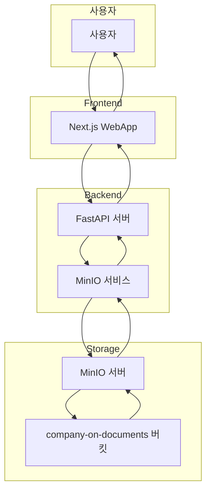

# MinIO 학습 가이드: S3 호환 객체 저장소 마스터하기

## 1. MinIO란 무엇인가?

MinIO는 **고성능, 분산 객체 저장소**입니다. Amazon S3와 완전히 호환되는 API를 제공하여 클라우드 네이티브 애플리케이션을 위한 객체 저장소 솔루션을 제공합니다.

### 주요 특징:
- **S3 호환**: Amazon S3 API와 100% 호환
- **고성능**: 초고속 읽기/쓰기 성능
- **확장성**: 수평적 확장 지원
- **보안**: 암호화, 접근 제어, 감사 로그
- **오픈소스**: Apache 2.0 라이선스

### MinIO 아키텍처:
```
[애플리케이션] → [MinIO Gateway] → [Backend Storage]
     ↓              ↓                    ↓
[API 호출]    [인증/권한]         [실제 파일 저장]
```

## 2. Company-on 프로젝트에서의 MinIO 역할

### 2.1 핵심 기능
Company-on 프로젝트에서 MinIO는 다음과 같은 역할을 담당합니다:

#### **📁 문서 파일 저장소**
- **원본 파일 저장**: 사용자가 업로드한 PDF, DOCX, 이미지 파일
- **처리된 파일 저장**: 텍스트 추출, 변환된 파일들
- **미리보기 파일**: 썸네일, 미리보기 이미지

#### **🔄 파일 업로드/다운로드 관리**
- **사전 서명된 URL**: 보안적인 파일 업로드/다운로드
- **임시 URL**: 시간 제한이 있는 접근 링크
- **파일 메타데이터**: 크기, 타입, 수정일 등

#### **📊 파일 관리**
- **버킷 관리**: 논리적 파일 그룹화
- **파일 검색**: 파일 존재 여부 확인
- **파일 삭제**: 불필요한 파일 정리

### 2.2 데이터 흐름


## 3. MinIO 설정 및 구현 (Company-on 프로젝트)

### 3.1 Docker Compose 설정
```yaml
minio:
  image: minio/minio:latest
  container_name: company-on-minio
  command: server /data --console-address ":9001"
  ports:
    - "9000:9000"  # API 포트
    - "9001:9001"  # 웹 콘솔 포트
  environment:
    - MINIO_ROOT_USER=minioadmin
    - MINIO_ROOT_PASSWORD=minioadmin
  volumes:
    - minio_data:/data
  networks:
    - company-on-network
  healthcheck:
    test: ["CMD", "curl", "-f", "http://localhost:9000/minio/health/live"]
    interval: 30s
    timeout: 20s
    retries: 3
```

### 3.2 MinIO 서비스 클래스 (`backend/app/services/minio_service.py`)

#### **초기화 및 버킷 생성**
```python
class MinIOService:
    def __init__(self):
        self.client = Minio(
            endpoint=os.getenv("MINIO_ENDPOINT", "localhost:9000"),
            access_key=os.getenv("MINIO_ACCESS_KEY", "minioadmin"),
            secret_key=os.getenv("MINIO_SECRET_KEY", "minioadmin"),
            secure=False  # 개발 환경에서는 HTTP 사용
        )
        self.bucket_name = "company-on-documents"
        self._ensure_bucket_exists()
```

#### **사전 서명된 URL 생성**
```python
def generate_upload_url(self, filename: str, expires_minutes: int = 30) -> tuple[str, str]:
    upload_id = str(uuid.uuid4())
    object_name = f"uploads/{upload_id}/{filename}"
    
    upload_url = self.client.presigned_put_object(
        bucket_name=self.bucket_name,
        object_name=object_name,
        expires=timedelta(minutes=expires_minutes)
    )
    return upload_id, upload_url
```

### 3.3 환경 변수 설정
```bash
# Docker Compose 환경 변수
MINIO_ENDPOINT=minio:9000
MINIO_ACCESS_KEY=minioadmin
MINIO_SECRET_KEY=minioadmin
MINIO_BUCKET_NAME=company-on-documents
```

## 4. 현재 발생한 문제점 분석

### 4.1 문제 상황
```
ERROR: minio.error.S3Error: S3 operation failed; code: SignatureDoesNotMatch, 
message: The request signature we calculated does not match the signature you provided. 
Check your key and signing method.
```

### 4.2 문제 원인 분석

#### **🔍 인증 정보 불일치**
- **MinIO 서버**: `MINIO_ROOT_PASSWORD=minioadmin`
- **백엔드 서비스**: `MINIO_SECRET_KEY=minioadmin` ✅
- **Celery 워커**: `MINIO_SECRET_KEY=minioadmin` ✅

#### **🔍 네트워크 연결 문제**
- **백엔드**: `minio:9000` (Docker 네트워크 내부)
- **Celery 워커**: `minio:9000` (Docker 네트워크 내부)
- **외부 접근**: `localhost:9000` (호스트에서)

#### **🔍 버킷 접근 권한**
- **버킷 이름**: `company-on-documents`
- **접근 권한**: 읽기/쓰기 권한 필요
- **버킷 정책**: 기본 정책 사용

### 4.3 문제 해결 방법

#### **방법 1: 인증 정보 확인**
```bash
# MinIO 서버 상태 확인
curl http://localhost:9000/minio/health/live

# MinIO 웹 콘솔 접근
http://localhost:9001
# 로그인: minioadmin / minioadmin
```

#### **방법 2: 버킷 정책 설정**
```bash
# MinIO CLI를 사용한 버킷 정책 설정
mc alias set myminio http://localhost:9000 minioadmin minioadmin
mc policy set public myminio/company-on-documents
```

#### **방법 3: 환경 변수 통일**
```yaml
# docker-compose.yml에서 모든 서비스의 MinIO 설정 통일
environment:
  - MINIO_ENDPOINT=minio:9000
  - MINIO_ACCESS_KEY=minioadmin
  - MINIO_SECRET_KEY=minioadmin
  - MINIO_BUCKET_NAME=company-on-documents
```

#### **방법 4: MinIO 서비스 재시작**
```bash
# MinIO 서비스 재시작
docker-compose restart minio

# 모든 서비스 재시작
docker-compose restart backend celery-worker celery-beat
```

## 5. 디버깅 및 모니터링

### 5.1 MinIO 상태 확인
```bash
# MinIO 서비스 상태
docker-compose ps minio

# MinIO 로그 확인
docker-compose logs minio --tail=20

# MinIO 헬스 체크
curl http://localhost:9000/minio/health/live
```

### 5.2 MinIO 웹 콘솔
- **URL**: http://localhost:9001
- **로그인**: minioadmin / minioadmin
- **기능**: 버킷 관리, 파일 업로드/다운로드, 정책 설정

### 5.3 MinIO CLI 도구
```bash
# MinIO CLI 설치 (선택사항)
curl https://dl.min.io/client/mc/release/linux-amd64/mc -o mc
chmod +x mc
./mc alias set myminio http://localhost:9000 minioadmin minioadmin

# 버킷 목록 확인
./mc ls myminio

# 파일 목록 확인
./mc ls myminio/company-on-documents
```

## 6. 성능 최적화 및 베스트 프랙티스

### 6.1 버킷 정책 최적화
- **공개 읽기**: 정적 파일 (이미지, CSS, JS)
- **인증된 읽기**: 사용자 문서
- **인증된 쓰기**: 업로드된 파일

### 6.2 파일 구조 최적화
```
company-on-documents/
├── uploads/           # 업로드된 원본 파일
│   └── {upload_id}/
│       └── {filename}
├── processed/         # 처리된 파일
│   └── {document_id}/
│       └── {chunk_id}.txt
└── previews/          # 미리보기 파일
    └── {document_id}/
        └── thumbnail.jpg
```

### 6.3 보안 강화
- **HTTPS 사용**: 프로덕션 환경에서 SSL/TLS
- **접근 제어**: IAM 정책 설정
- **암호화**: 서버 측 암호화 (SSE)
- **감사 로그**: 모든 접근 기록

## 7. 문제 해결 체크리스트

### ✅ 기본 확인사항
- [ ] MinIO 서비스가 정상 실행 중인가?
- [ ] 환경 변수가 모든 서비스에서 일치하는가?
- [ ] 버킷이 존재하고 접근 가능한가?
- [ ] 네트워크 연결이 정상인가?

### ✅ 인증 문제 해결
- [ ] MinIO 루트 사용자/비밀번호 확인
- [ ] 모든 서비스의 ACCESS_KEY/SECRET_KEY 통일
- [ ] MinIO 웹 콘솔 로그인 테스트
- [ ] 버킷 정책 설정 확인

### ✅ 연결 문제 해결
- [ ] Docker 네트워크 내부 연결 테스트
- [ ] 외부 접근 (localhost:9000) 테스트
- [ ] 방화벽/포트 차단 확인
- [ ] DNS 해석 문제 확인

### ✅ 권한 문제 해결
- [ ] 버킷 생성 권한 확인
- [ ] 파일 업로드/다운로드 권한 확인
- [ ] 버킷 정책 설정
- [ ] IAM 정책 설정 (고급)

## 8. 학습 포인트

### 8.1 MinIO의 장점
- **S3 호환성**: 기존 S3 코드 재사용 가능
- **로컬 개발**: 클라우드 없이 로컬에서 테스트
- **비용 효율**: 오픈소스로 무료 사용
- **성능**: 높은 처리량과 낮은 지연시간

### 8.2 주의사항
- **데이터 지속성**: 볼륨 마운트 필수
- **보안**: 기본 인증 정보 변경 필요
- **백업**: 정기적인 데이터 백업
- **모니터링**: 디스크 사용량 및 성능 모니터링

### 8.3 확장 방안
- **분산 배포**: 여러 노드에 MinIO 클러스터 구성
- **캐싱**: Redis와 연동한 캐싱 전략
- **CDN 연동**: 정적 파일 CDN 배포
- **백업 전략**: 자동 백업 및 복구 시스템

---

## 🎯 현재 상황 요약

**MinIO는 Company-on 프로젝트의 파일 저장소 역할을 담당하며, 현재 인증 문제로 인해 Celery 워커에서 파일 접근이 실패하고 있습니다. 위의 해결 방법들을 시도해보시면 문제를 해결할 수 있을 것입니다!**
